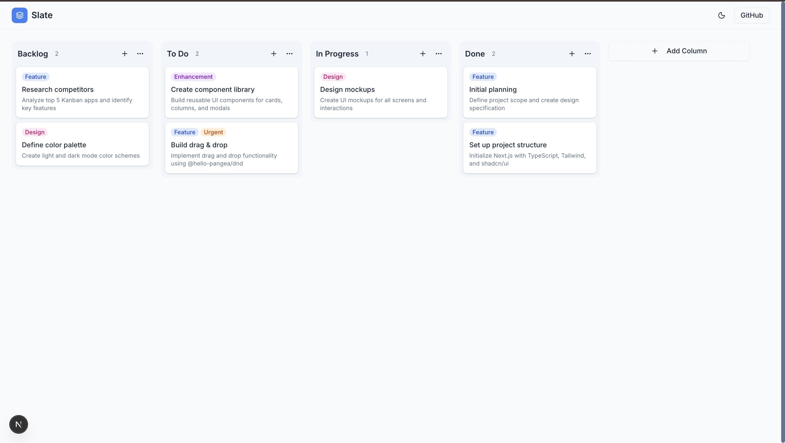
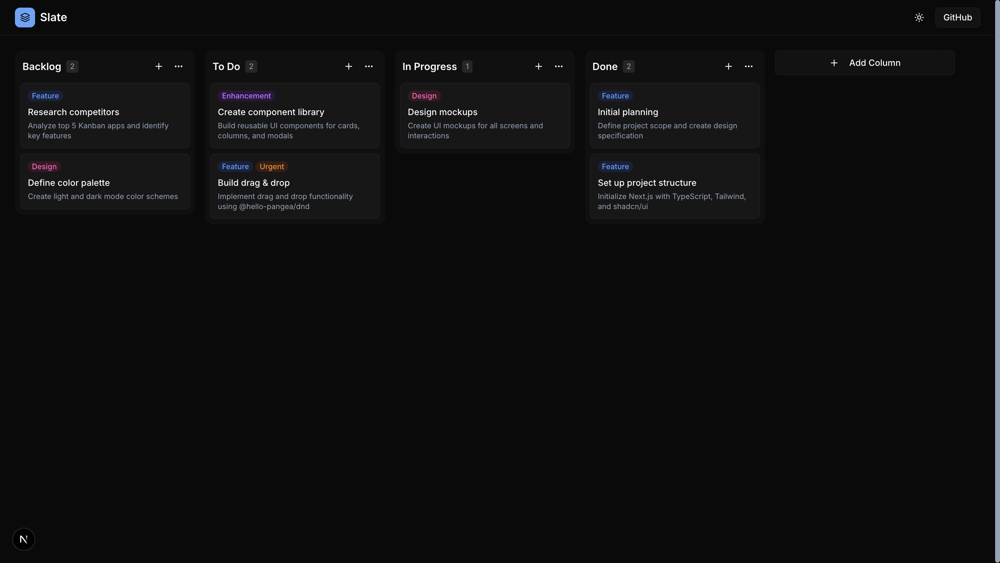

# Slate

A beautiful, minimal Kanban board for organizing your tasks. Built with Next.js, Tailwind CSS, and smooth drag-and-drop interactions.


## Screenshots

| Light Mode | Dark Mode |
|------------|-----------|
|  |  |

## Features

- **Drag & Drop** - Smoothly drag cards between columns and reorder columns
- **Dark/Light Mode** - Toggle between themes with system preference support
- **Full CRUD** - Create, edit, and delete cards and columns
- **Labels** - Color-coded labels for organizing tasks (Bug, Feature, Enhancement, etc.)
- **Persistent Storage** - Board state saved to localStorage
- **Responsive Design** - Works on desktop and mobile with horizontal scrolling

## Tech Stack

- [Next.js 14](https://nextjs.org/) - React framework with App Router
- [TypeScript](https://www.typescriptlang.org/) - Type safety
- [Tailwind CSS](https://tailwindcss.com/) - Utility-first styling
- [shadcn/ui](https://ui.shadcn.com/) - Accessible UI components
- [@hello-pangea/dnd](https://github.com/hello-pangea/dnd) - Drag and drop
- [next-themes](https://github.com/pacocoursey/next-themes) - Theme switching

## Getting Started

```bash
# Clone the repository
git clone https://github.com/ilhammramadhan/slate.git

# Navigate to project
cd slate

# Install dependencies
npm install

# Run development server
npm run dev
```

Open [http://localhost:3000](http://localhost:3000) to view the app.

## Project Structure

```
src/
├── app/
│   ├── globals.css      # Theme colors and styles
│   ├── layout.tsx       # Root layout with providers
│   ├── page.tsx         # Home page
│   └── providers.tsx    # Theme provider wrapper
├── components/
│   ├── board/
│   │   ├── board.tsx    # Main board with drag context
│   │   ├── column.tsx   # Droppable column component
│   │   └── task-card.tsx # Draggable card component
│   ├── modals/
│   │   ├── card-modal.tsx   # Card create/edit dialog
│   │   └── column-modal.tsx # Column create/edit dialog
│   ├── ui/              # shadcn/ui components
│   ├── header.tsx       # App header with theme toggle
│   └── theme-toggle.tsx # Dark/light mode switch
├── hooks/
│   └── use-board.ts     # Board state management
└── lib/
    ├── demo-data.ts     # Initial board data
    ├── types.ts         # TypeScript interfaces
    └── utils.ts         # Utility functions
```

## License

MIT
